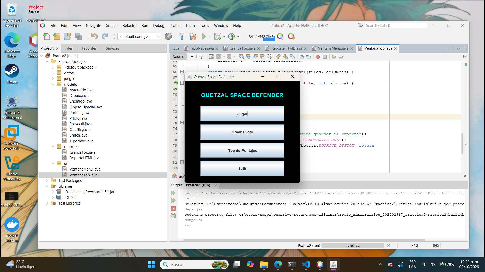
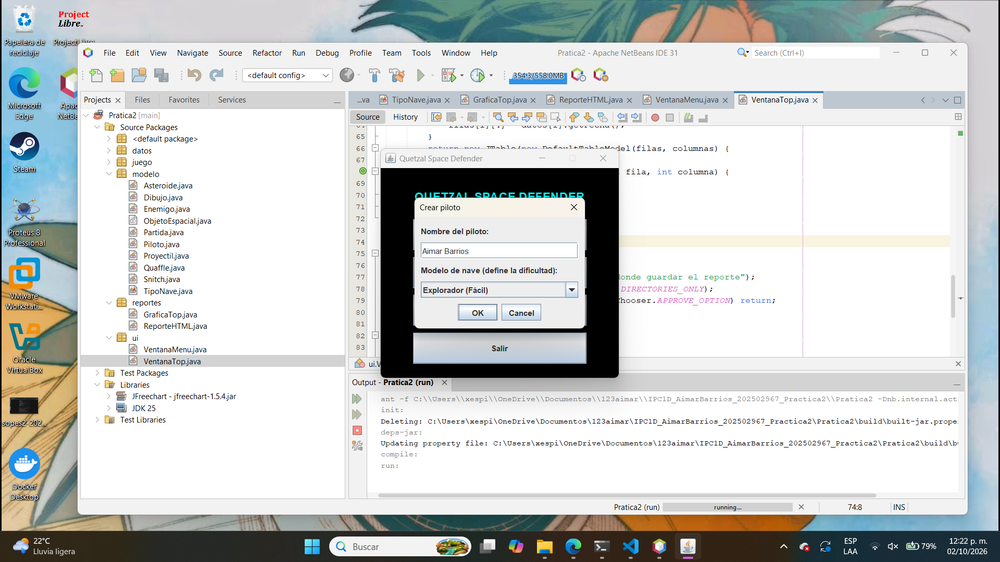
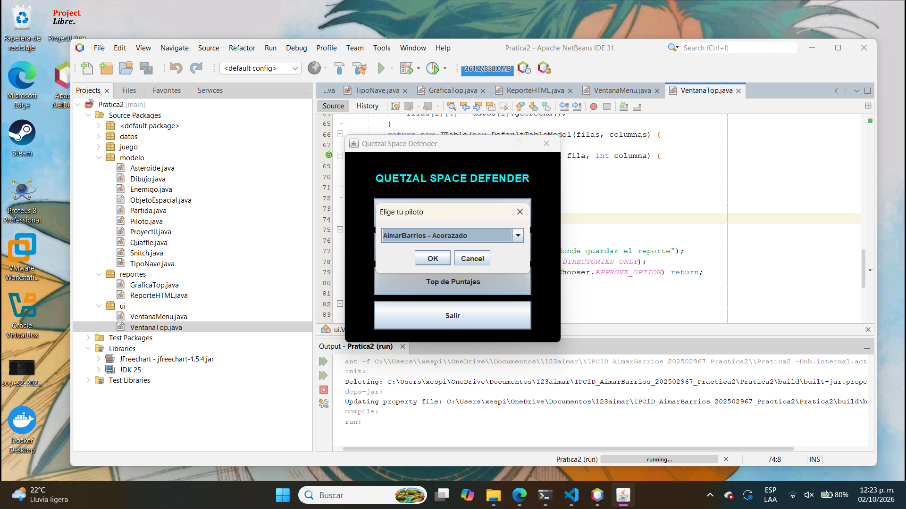
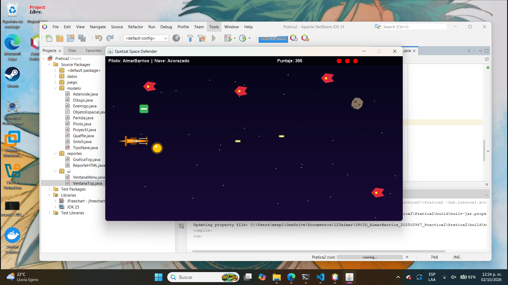
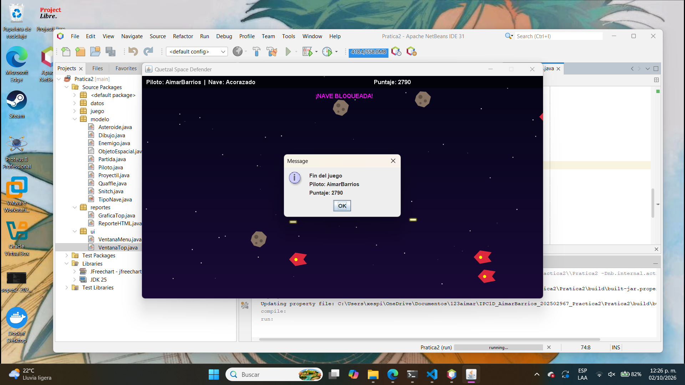
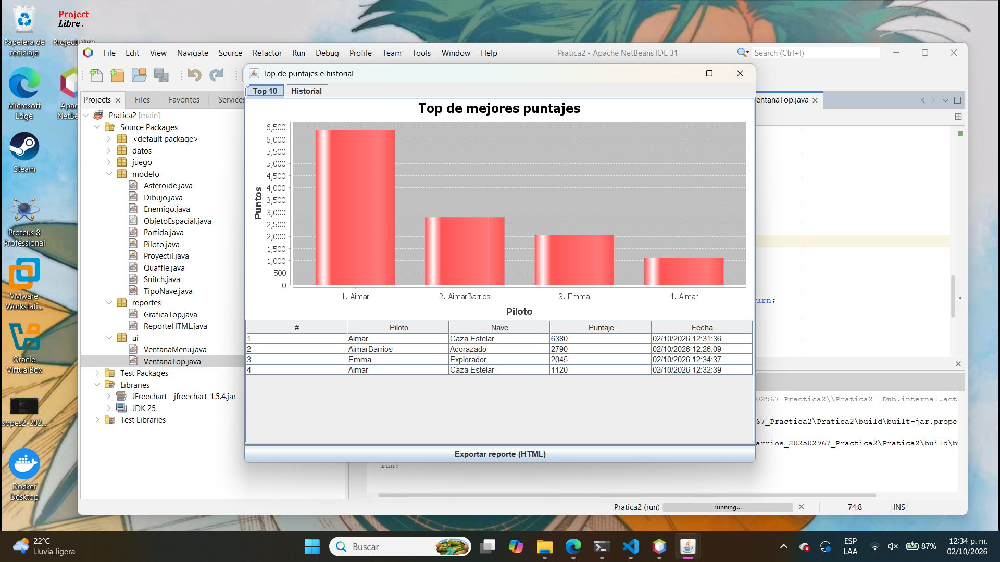
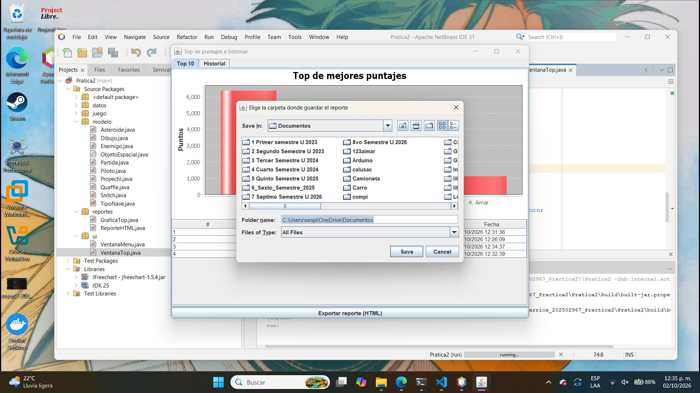

# Manual de Usuario - Quetzal Space Defender

## Introducción
Quetzal Space Defender es un juego de naves que funciona de forma horizontal. El jugador elige un piloto y una nave, y debe esquivar o destruir enemigos y asteroides mientras recolecta premios, hasta quedarse sin vidas.

## 1. Menú principal

Al abrir el programa aparece el menú principal con 4 opciones:
- **Jugar**: elige un piloto ya creado y comienza una partida.
- **Crear Piloto**: registra un nuevo piloto con su nave.
- **Top de Puntajes**: muestra la gráfica, el historial y permite exportar el reporte.
- **Salir**: cierra el programa.

## 2. Crear Piloto

Al pulsar **Crear Piloto** se abre un formulario con:
- Un campo de texto para el **nombre** (3 a 15 caracteres, solo letras, números y guion bajo, sin espacios ni tildes).
- Un menú desplegable para elegir el **modelo de nave**, que define la dificultad.

| Nave | Dificultad | Característica |
|---|---|---|
| Explorador | Fácil | Rápida, dispara cada 2 s |
| Caza Estelar | Normal | Velocidad media, dispara cada 1 s |
| Acorazado | Difícil | Lenta, dispara cada 0.3 s |

Si el nombre está vacío, repetido o tiene caracteres no permitidos, el sistema muestra
un mensaje de error y permite corregirlo sin perder los datos ya escritos.

## 3. Jugar

Al pulsar **Jugar**, se elige uno de los pilotos ya creados y comienza la partida.

**Controles:**
- Flechas o teclas W, A, S, D: mover la nave.
- Barra espaciadora: disparar.

**Elementos en pantalla:**
- El HUD en la parte superior muestra el nombre del piloto, la nave, el puntaje y las vidas restantes (bolitas rojas).
- Los enemigos (platillos morados) y asteroides aparecen del lado derecho y avanzan hacia la izquierda.
- El **Contenedor Quaffle** (verde) suma 10 puntos.
- La **Snitch Espacial** (dorada) suma 150 puntos y destruye a todos los enemigos visibles.
- El **Asteroide** bloquea la nave por 2 segundos si choca con ella.

**Juego en Ejecucciòn**

La partida termina cuando se pierden las 3 vidas, y el puntaje queda guardado en el historial del piloto.

## 4. Top de Puntajes

Desde el menú principal, **Top de Puntajes** abre una ventana con dos pestañas:
- **Top 10**: gráfica de barras con los mejores puntajes registrados.
- **Historial**: tabla con todas las partidas jugadas (piloto, nave, puntaje y fecha).

## 5. Exportar reporte

En la parte inferior de la ventana de Top de Puntajes está el botón
**Exportar reporte (HTML)**. Al pulsarlo:
1. Se abre un explorador de archivos para elegir la carpeta donde guardar el reporte.
2. Se generan dos archivos: `grafica_top.png` y `reporte_quetzal.html`.

Para obtenerlo en PDF, abre `reporte_quetzal.html` con el navegador y usa *(cntrl + p)*, 
**Imprimir > Guardar como PDF**.